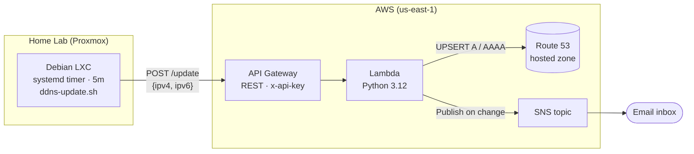

# DDNS Provider

Dynamic DNS for a home lab. Consumer ISPs rotate the public IPv4 (and sometimes IPv6) on the house. This project keeps a Route 53 A/AAAA record pointed at the current IP so Wireguard (and anything else running in the home lab) stays reachable by hostname.

## How it works



- Every 5 min the Debian LXC detects its current IPv4 (via `https://ifconfig.me`) and global IPv6 (from `ip -6 addr` on a configured interface), compares against a cached state file, and POSTs any changes to API Gateway.
- The Lambda validates the IPs, reads the current Route 53 values, `UPSERT`s only what actually differs, and publishes a message to SNS when it does.
- SNS emails the notification to a subscribed address.

Costs are effectively zero: Route 53 hosted zone ($0.50/mo) plus fractions of a cent for Lambda / API Gateway / SNS at 5-minute polling.

## Repo layout

```
ddns/
├── client/       # Debian LXC side: bash script + systemd timer/service
├── server/       # AWS Lambda handler (Python 3.12)
└── terraform/    # AWS infrastructure (Route 53 record lookup, Lambda, API Gateway, SNS, Resource Group)
```

## Prerequisites

- An AWS account with a Route 53 **public hosted zone already created** for your domain (this project uses it by data source; it does not manage the zone itself).
- Terraform `>= 1.5` installed locally.
- A Debian-based host to run the client (the intended target is an unprivileged LXC on Proxmox).

---

## 1. Authenticate to AWS

This project uses **IAM Identity Center** (AWS's modern, SSO-style auth — the equivalent of `az login`). No long-lived keys on disk; sessions expire after a few hours and refresh with `aws sso login`. Terraform picks up the credentials via `AWS_PROFILE`.

One-time setup in the AWS Console:

1. Open **IAM Identity Center** and click **Enable** (free). Pick a region for the identity store — `us-east-1` is fine.
2. **Users** → **Add user**. Create yourself. You'll get an email to set a password and enroll MFA.
3. **AWS accounts** (or **Multi-account permissions → AWS accounts** in newer UI) → check the box next to your account → **Assign users or groups**. In the wizard:
   - **Users and groups**: select yourself → **Next**.
   - **Permission sets**: empty on first run — click **Create permission set** (opens a new tab). Choose **Predefined permission set → AdministratorAccess**, accept defaults, **Create**. Back on the wizard tab, refresh the list and select `AdministratorAccess` → **Next**.
   - **Review and submit** → **Submit**. Wait for status to show **Provisioned**.
4. Note the **AWS access portal URL** from the Identity Center dashboard (looks like `https://d-xxxxxxxxxx.awsapps.com/start`).

On your workstation, one time:

```bash
aws configure sso
```

Prompts:
- SSO start URL → the access portal URL
- SSO region → whichever region you enabled Identity Center in
- Browser opens; approve the request
- Pick your account and the `AdministratorAccess` role
- CLI profile name → `ddns`

Day-to-day, when your session has expired:

```bash
aws sso login --profile ddns
```

Then prefix Terraform commands with `AWS_PROFILE=ddns` (or `export AWS_PROFILE=ddns` for the shell).

---

## 2. Deploy the AWS infrastructure

```bash
cd terraform/
cp config/example.tfvars config/prod.tfvars
# Edit config/prod.tfvars: fill in zone_name, record_name, notify_email

AWS_PROFILE=ddns terraform init
AWS_PROFILE=ddns terraform plan  -var-file=config/prod.tfvars
AWS_PROFILE=ddns terraform apply -var-file=config/prod.tfvars
```

After apply:

- AWS will send a subscription confirmation email to `notify_email` — **click the link** or no notifications will arrive.
- Grab the outputs:
  ```bash
  terraform output -raw api_invoke_url
  terraform output -raw api_key_value     # sensitive — don't log / commit
  ```

### Smoke-test the Lambda

```bash
API_URL=$(AWS_PROFILE=ddns terraform output -raw api_invoke_url)
API_KEY=$(AWS_PROFILE=ddns terraform output -raw api_key_value)
curl -fsS -X POST -H "x-api-key: $API_KEY" -H "Content-Type: application/json" \
  --data '{"ipv4":"203.0.113.42"}' "$API_URL"
```

Expect `{"changed":["A"],"unchanged":[]}` on the first call and an email from SNS. Re-run the same curl and expect `changed: []` and no email.

Verify DNS propagation:

```bash
dig +short A  home.example.com
dig +short AAAA home.example.com
```

---

## 3. Install the client on the LXC

From the LXC (or copy the `client/` dir over first):

```bash
sudo ./client/install.sh
sudo $EDITOR /etc/ddns-client/ddns-client.env   # fill in API_URL, API_KEY, RECORD_NAME, IPV6_IFACE
sudo systemctl start ddns-client.service        # trigger an immediate run
journalctl -u ddns-client.service -n 50
```

The installer:
- Creates a `ddns` system user.
- Installs `ddns-update.sh` to `/usr/local/bin/`.
- Seeds `/etc/ddns-client/ddns-client.env` from the example (mode `0640`, group-readable by `ddns`).
- Enables `ddns-client.timer` to run every 5 minutes.

Find `IPV6_IFACE` with `ip -o -6 addr show scope global` on the LXC; pick the interface whose `/64` is routed from your ISP.

### Operations

- **Force a run**: `sudo systemctl start ddns-client.service`
- **Client logs**: `journalctl -u ddns-client.service`
- **Lambda logs**: CloudWatch Logs → `/aws/lambda/ddns-updater` (retention 14 days)
- **All resources**: AWS Console → Resource Groups & Tag Editor → saved group `ddns`

### Rotating the API key

Run `terraform taint aws_api_gateway_api_key.client && terraform apply`, then copy the new key into `/etc/ddns-client/ddns-client.env` on the LXC.

## Out of scope

- Automatic API-key rotation.
- CloudWatch alarms beyond Lambda's default logging.
- Multiple records per stack — re-apply with a different `record_name` in a separate workspace/state if you need a second host.
- TLS client certs, HMAC signing, or IP allowlisting on top of the API key.
